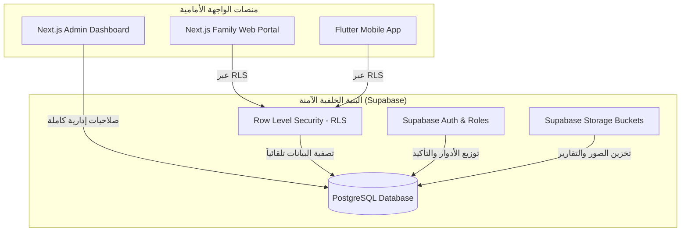

# 🌟 نظام إدارة دار شمس التعافي (Dar Shams Al-Ta'afi)

> [!NOTE]  
> **حالة النظام:** مكتمل وجاهز للإنتاج (Production-Ready) ✅  
> نظام متكامل، فائق الأمان، ومتعدد المنصات لإدارة مصحات الطب النفسي وعلاج الإدمان، مصمم لربط الطاقم الطبي والإداري بأهالي المقيمين بشكل لحظي وبأعلى معايير الخصوصية الطبية.

---

## 🏛️ الفلسفة التصميمية وتجربة المستخدم (UX/UI)

تم بناء وتصميم النظام بالاعتماد على **أعلى معايير التصميم الحديثة والأنيقة (Premium Design System)** لضمان تجربة مستخدم مذهلة ومريحة:
*   **تصميم زجاجي عصري (Glassmorphism)**: استخدام الشفافية والظلال الناعمة لتقليل التشتت البصري وإضفاء لمسة جمالية فاخرة.
*   **ألوان متناسقة وتدرجات ذكية (Elegant Gradients)**: الابتعاد عن الألوان الحادة والتقليدية واستخدام لوحة ألوان مستوحاة من الطبيعة والشفاء والتعافي.
*   **خطوط طباعية ممتازة (Premium Typography)**: استخدام خطوط ويب احترافية مثل (Inter, Outfit, Cairo) لضمان وضوح النصوص والقراءة المريحة على كافة الشاشات.
*   **تصميم متجاوب ومتكامل للهواتف (Mobile-First UX)**: تهيئة 99% من واجهات بوابات الأهالي وتطبيق الموبايل لتعمل بسلاسة فائقة مع حركات وتأثيرات لمسية تفاعلية جذابة.

---

## 🛠️ هيكلية النظام والمنصات (Architecture)

يتكون المشروع من ثلاثة أجزاء متكاملة تعمل بالتنسيق اللحظي عبر قاعدة بيانات موحدة:



### 1. لوحة التحكم الإدارية — Executive Admin Dashboard (`/dashboard`)
بوابة الطاقم الطبي والإداري للتحكم الكامل ببيانات المصحة:
*   **الرئيسية**: إحصائيات فورية، لوحة تحكم للمقيمين الجدد، والمؤشرات السريعة.
*   **ملف المقيم الشامل**: إدارة بيانات المقيم، كتابة اليوميات والتحديثات العلاجية، وإرفاق التقارير الأسبوعية/الشهرية، وربط حساب الأسرة بصلاحيات تفصيلية.
*   **نظام الترقيم التلقائي المبتكر (Auto File Number)**: توليد رقم ملف حصري تلقائي بصيغة `SHAMS-YYYY-XXXX` عبر Trigger يمنع Race Condition.
*   **إدارة الرسائل والإشعارات**: استقبال رسائل الأهالي والرد عليها لحظياً، وإرسال إشعارات مخصصة فردية أو جماعية للأهالي.
*   **التحكم بالمعرض والأخبار**: رفع صور المرافق (عامة) وصور المقيم (خاصة)، وإدارة الأخبار مع نظام ترتيب ذكي (`sort_order`).

### 2. بوابة الأهالي الويب — Family Web Portal (`/dashboard/family`)
بوابة إلكترونية مهيأة للهواتف الذكية تمنح الأهالي الطمأنينة الكاملة لمتابعة ذويهم:
*   **ترحيب ذكي (Smart Welcome)**: يعرض رسالة مخصصة وفقاً للمقيم المربوط بالحساب.
*   **مؤشر التقدم البصري (Progress Trend Chart)**: يعرض تقدم المقيم العلاجي بنسب مئوية ورسوم بيانية مبسطة.
*   **قسم التحديثات والتقارير**: استعراض اليوميات الطبية والتقارير المنشورة فقط من قبل الإدارة.
*   **المعرض الآمن والLightbox**: تصفح الصور العامة للمركز والصور الخاصة بالمقيم داخل مشغل صور تفاعلي وسلس.
*   **قناة تواصل آمنة**: تبادل الرسائل المباشرة مع الإدارة ومتابعة الردود الواردة.

### 3. تطبيق الموبايل للأهالي — Flutter Mobile App (`/mobile_app`)
تطبيق موبايل أصيل (Native App) مكتوب بلغة Dart وإطار العمل Flutter للأندرويد والـ iOS:
*   **شريط الأخبار التفاعلي (News Ticker Bubbles)**: يعرض آخر أخبار المركز بطريقة مميزة تدعم اللمس المريح.
*   **ملف المقيم والتقارير**: واجهات سريعة ذات استجابة عالية لعرض التحديثات الطبية والصور.
*   **مركز الإشعارات اللحظي (Notification Hub)**: استقبال فوري لجميع الإشعارات الموجهة للأسرة مع تتبع حالة القراءة.
*   **الاتصال السريع والطوارئ**: أزرار اتصال مخصصة وسهلة الوصول للاتصال بالدعم أو الطاقم الطبي المباشر.

---

## 🔒 حماية البيانات والأمان الفائق (Hardening & RLS)

> [!IMPORTANT]  
> يتمتع النظام بأعلى درجات الخصوصية الطبية التي تمنع تماماً أي وصول غير مصرح به أو تسريب لبيانات المقيمين الحساسة.

1.  **Row Level Security (RLS)**: تم تفعيل سياسات أمان صارمة على كافة جداول قاعدة البيانات. لا يمكن لأي حساب "أهل" قراءة أي سجل إلا إذا كان مرتبطاً بالمقيم برمجياً في جدول `family_links` وبحالة نشطة (`is_active = true`).
2.  **التخزين الخاص والمحمي (Private Storage)**:
    *   `public-gallery` و `news-images`: مستودعات عامة متاحة لصور المركز والأخبار.
    *   `private-resident-media` و `report-files`: مستودعات خاصة بالكامل؛ لا يمكن تصفح الملفات فيها إلا من خلال روابط موقعة مؤقتة (Signed URLs) تُولد فقط للمستخدمين المصرح لهم بموجب سياسات RLS وقواعد التحقق من الأدوار.
3.  **سجل التدقيق الآلي (Audit Logging)**: يقوم النظام تلقائياً بتسجيل أي عملية إضافة، تعديل، أو حذف للبيانات الحساسة في جدول `audit_logs` متضمناً هوية المستخدم، نوع العملية، البيانات القديمة، والجديدة لمراجعة أي نشاط لاحقاً.

---

## 📂 هيكل مجلدات المشروع

```text
├── dashboard/               # تطبيق Next.js 14 (لوحة التحكم وبوابة الويب للأهالي)
│   ├── src/
│   │   ├── components/      # المكونات البرمجية المشتركة (Sidebar, FamilyNavbar, Widgets...)
│   │   ├── lib/             # إعدادات Supabase والاتصال بقاعدة البيانات
│   │   ├── middleware.ts    # جدار الحماية وتوجيه المستخدمين حسب الأدوار
│   │   └── pages/           # مسارات الصفحات ولوحة التحكم والبوابات
│   └── package.json
│
├── mobile_app/              # تطبيق Flutter للأهالي
│   ├── lib/
│   │   ├── screens/         # شاشات التطبيق (الرئيسية، المقيم، التقارير، الإشعارات...)
│   │   └── main.dart        # نقطة البداية وإعدادات Supabase Flutter SDK
│   └── pubspec.yaml
│
└── supabase/                # تهيئة قاعدة البيانات وقواعد الأمان
    ├── schema.sql           # الهيكل الأساسي للجداول، السياسات (RLS)، والمحفزات (Triggers)
    └── schema_v2_additions.sql  # التحديثات والتحسينات الإضافية لقاعدة البيانات (المرحلة الثانية)
```

---

## 🚀 تعليمات التشغيل والتنصيب من الصفر

### 1. إعداد خادم وقاعدة بيانات Supabase
1. قم بإنشاء مشروع جديد في منصة [Supabase](https://supabase.com).
2. اذهب إلى الـ **SQL Editor** داخل لوحة تحكم Supabase.
3. انسخ محتويات ملف `supabase/schema.sql` بالكامل وقم بتشغيله (Run) لإنشاء الجداول والTriggers الأساسية.
4. انسخ محتويات ملف `supabase/schema_v2_additions.sql` وقم بتشغيله لإضافة الميزات الحديثة وتأمين الأعمدة المتقدمة.
5. اذهب إلى قسم **Storage** وتأكد من إنشاء الـ Buckets التالية بنفس التكوين:
    *   `public-gallery` (عام / Public)
    *   `news-images` (عام / Public)
    *   `private-resident-media` (خاص / Private)
    *   `report-files` (خاص / Private)

### 2. تشغيل لوحة التحكم وبوابة الويب (`dashboard`)
1. ادخل إلى مجلد لوحة التحكم:
   ```bash
   cd dashboard
   ```
2. أنشئ ملف بيئة محلي باسم `.env.local` وأضف بيانات الربط الخاصة بمشروعك على Supabase:
   ```env
   NEXT_PUBLIC_SUPABASE_URL=https://your-project-id.supabase.co
   NEXT_PUBLIC_SUPABASE_ANON_KEY=your-anon-public-key
   ```
3. قم بتثبيت الاعتمادات والتشغيل:
   ```bash
   npm install
   npm run dev
   ```
4. تصفح النظام عبر الرابط: `http://localhost:3000`.

### 3. تشغيل تطبيق الموبايل (`mobile_app`)
1. تأكد من تثبيت Flutter SDK على جهازك.
2. ادخل إلى مجلد التطبيق:
   ```bash
   cd mobile_app
   ```
3. قم بتنزيل الحزم المطلوبة:
   ```bash
   flutter pub get
   ```
4. تأكد من تهيئة بيانات الاتصال بـ Supabase في ملف `lib/main.dart` داخل دالة `Supabase.initialize`.
5. قم بتشغيل التطبيق على المحاكي أو جهاز حقيقي:
   ```bash
   flutter run
   ```

---

## 📊 تدفق دورة البيانات الأساسية (Data Lifecycle Flow)

*   **الأخبار والإعلانات**:
    ```text
    الإدارة تنشر خبراً (مرئي للعامة) ──> يُحفظ في Supabase (news) ──> يظهر فوراً في شريط الأخبار التفاعلي بالموقع وتطبيق الموبايل
    ```
*   **التحديثات اليومية للمقيمين**:
    ```text
    الطبيب يضيف تحديثاً (مرئي للأهل) ──> يُحفظ في Supabase (resident_updates) ──> RLS تحصر الرؤية لعائلة المقيم فقط ──> تظهر في ملف المقيم بالبوابة والتطبيق
    ```
*   **المراسلات والدعم**:
    ```text
    الأسرة ترسل استفساراً ──> يُحفظ في جدول (messages) ──> يظهر إشعار للإدارة بالDashboard ──> الإدارة تكتب الرد ──> يصل الرد للأسرة على البوابة لحظياً
```

---

## 🗺️ خريطة الطريق والميزات المستقبلية (Roadmap)

نعمل باستمرار على الارتقاء بمستويات الرعاية والشفافية؛ إليكم أبرز ميزاتنا القادمة:
*   **الجدول اليومي المباشر**: تتبع لحظي لحصص التأهيل، الجلسات العلاجية الفردية، والوجبات اليومية للمقيم.
*   **نظام الأوسمة والإنجازات (Milestones & Badges)**: منح أوسمة رقمية تشجيعية للمقيمين تظهر للأهالي عند اجتياز العقبات بنجاح.
*   **حجز الاستشارات عن بعد (Telehealth)**: حجز وجدولة مكالمات فيديو مباشرة مع المعالجين النفسيين وأطباء الحالة عبر البوابة.
*   **بوابة الدفع الإلكتروني المدمجة**: دفع الفواتير الشهرية وتحويل ميزانية "الأمانات" للمقيمين ببطاقات الائتمان ومحافظ الموبايل بيسر وأمان.
*   **نظام تحليلات الذكاء الاصطناعي (AI Analytics)**: التنبؤ بمؤشرات الانتكاس بناءً على تقارير السلوك اليومية لتنبيه الأطباء مبكراً.

---

## 📞 الدعم والمساعدة الفنية

إذا واجهتك أي مشكلة أثناء التنصيب أو التشغيل، أو للاستفسارات الفنية والإدارية، يُرجى التواصل معنا:
*   **رقم الهاتف الساخن / واتساب**: `01115540077` 📞
*   **البريد الإلكتروني للدعم الفني**: `support@darshams.com` ✉️

---
*صُنع بكل حب وعناية لخدمة رحلة الشفاء والأمل في دار شمس التعافي.* ☀️💚

